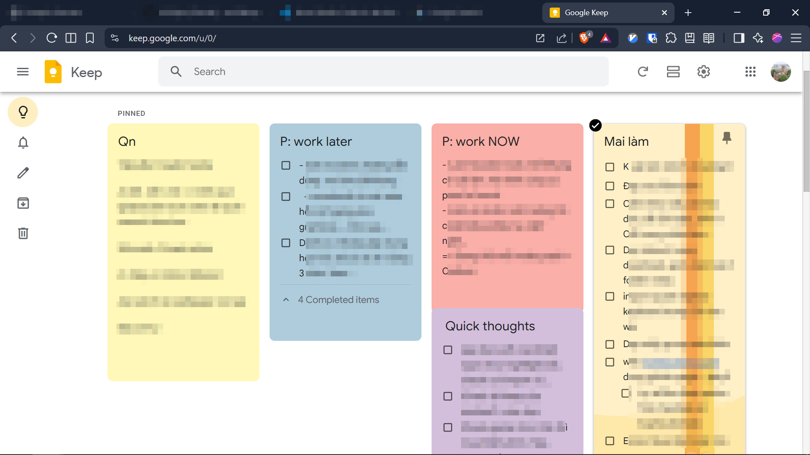
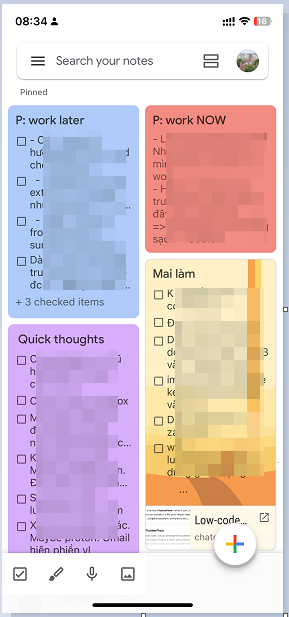
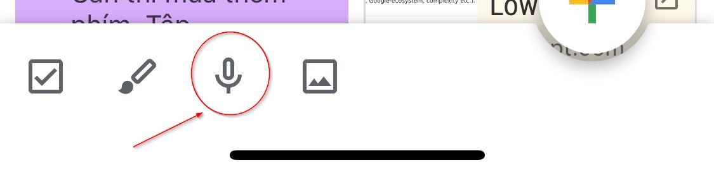
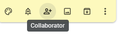

# Google Keep: App take note cuối cùng mà bạn dùng

## TLDR
[keep.google.com](https://keep.google.com/u/0/)


- Giao diện web:

- Giao diện app điện thoại:


## Tips và Tricks sử dụng Google Keep hiệu quả
- Hay quên? Sử dụng tính năng *Reminder*.

`Nhắc lấy chìa khóa khi về nhà` -> Tạo reminder dựa trên vị trí.

`Chiều nay có hẹn với X` -> Tạo reminder dựa trên thời gian.

- Sắp xếp ghi chú bằng màu sắc và nhãn dán (Labels).
- Sử dụng tính năng ghi âm để ghi chú nhanh khi không tiện gõ.

- Tạo checkbox để quản lý công việc hàng ngày.
- Chia sẻ ghi chú với đồng nghiệp (collab button) để cộng tác hiệu quả.

- *Quan trọng nhất*: Sử dụng đúng *1 app* ghi chú duy nhất để tránh phân tán thông tin.
Và dễ dàng truy hồi, tìm kiếm khi cần.

## Kết luận
Google Keep là một công cụ mạnh mẽ giúp bạn quản lý ý tưởng và ghi chú một
cách hiệu quả.

Hãy tận dụng các tính năng của nó để nâng cao năng suất làm việc và giải tỏa áp lực cho bộ nhớ RAM não bộ nhé. 🧠💪🏢

Mọi đóng góp ý kiến xin gửi về [Zalo](https://zalo.me/0339098099).

```sig
Together, we Shine!
Andre - Vũ Trần Việt Hải.
```
